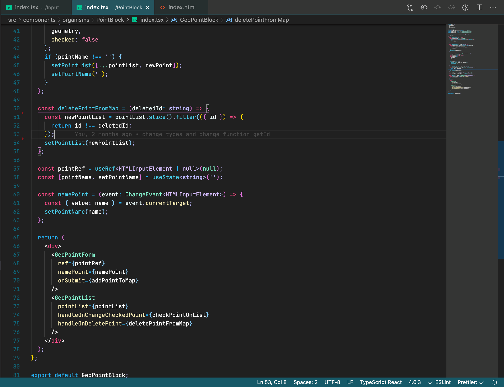
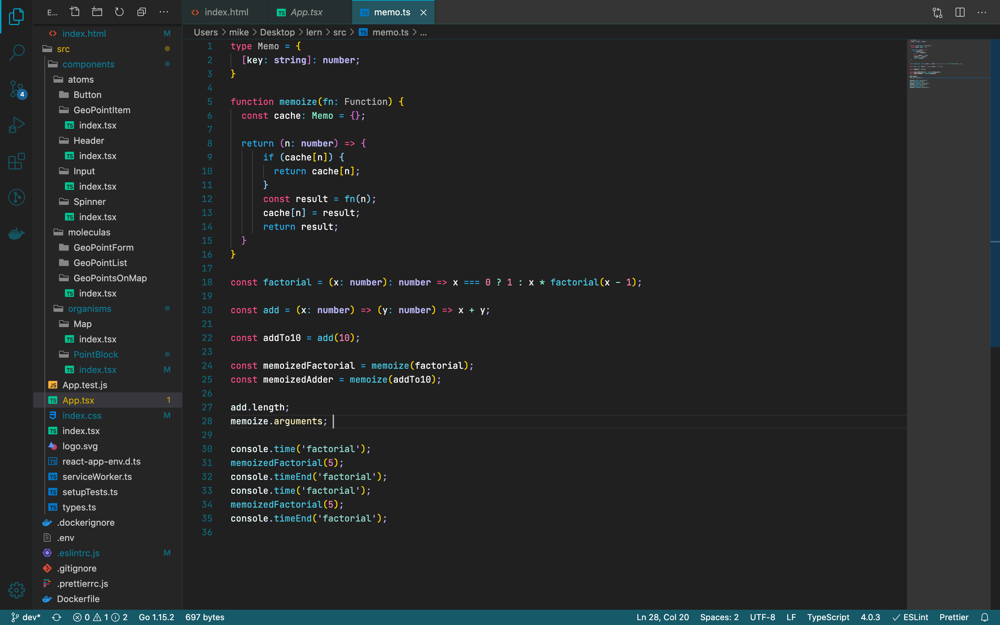
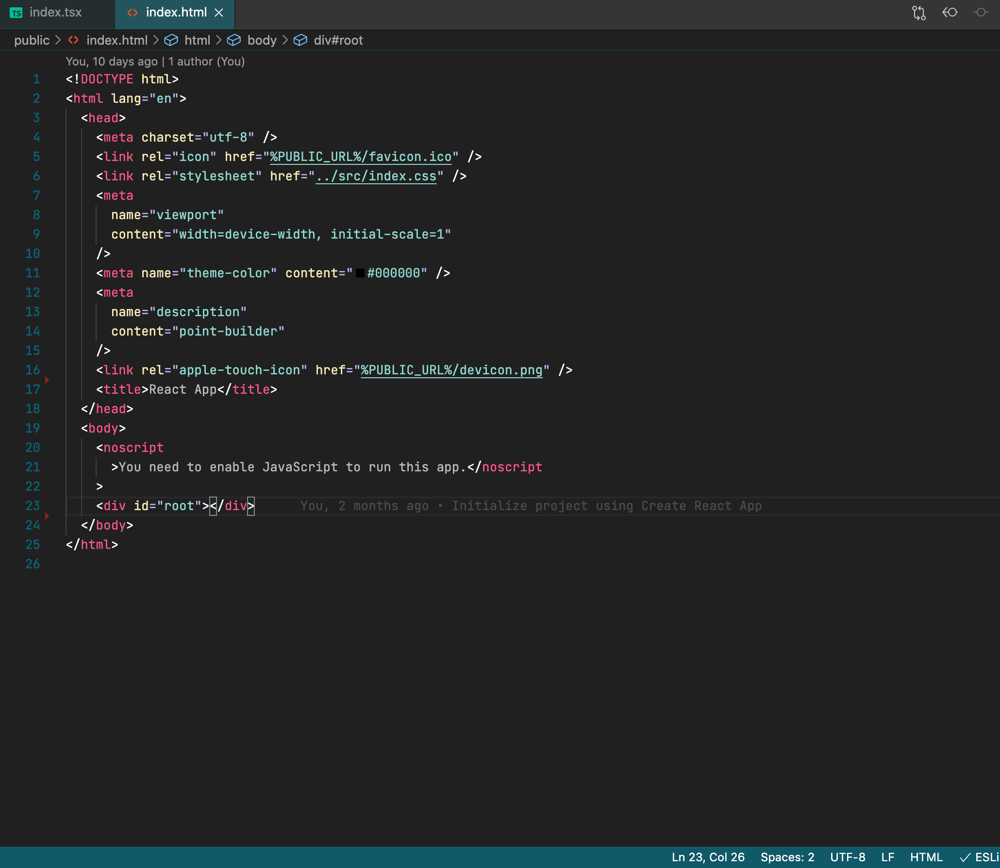
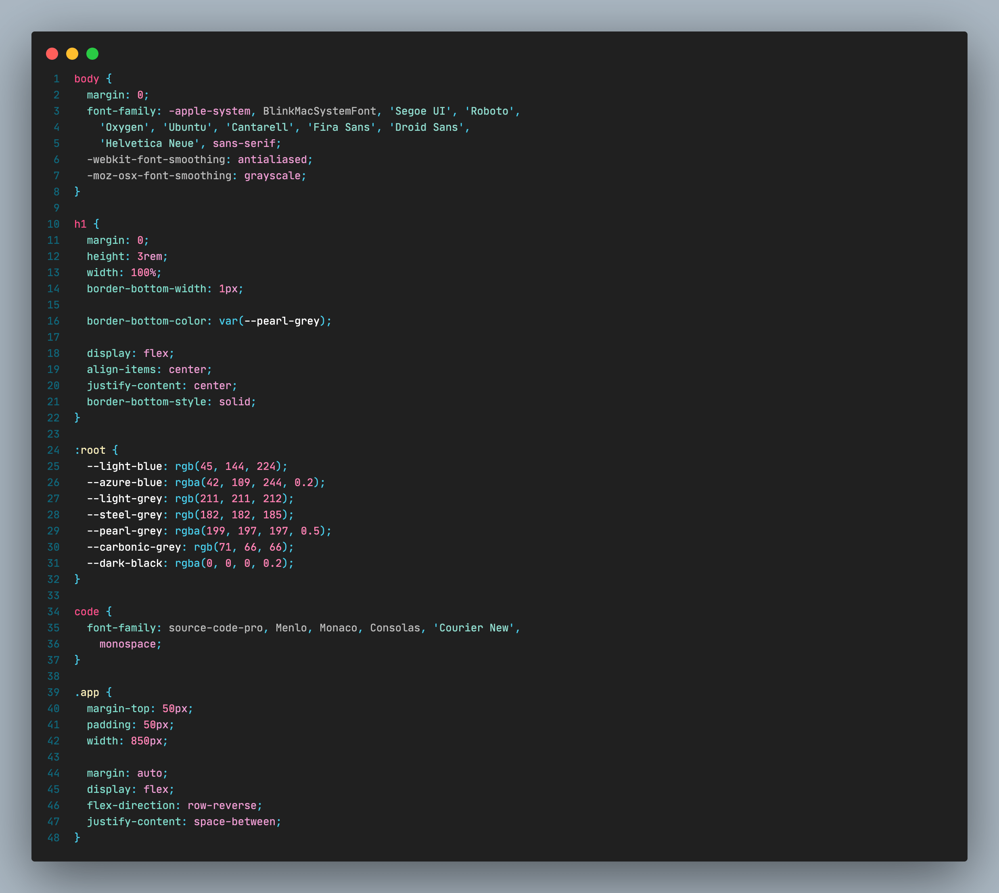

# No Change Theme

This is color theme extension for Vscode that add new dart palette to your IDE.

In most cases programers use dark theme for your daily needs. There's only a dark theme now. But in the next updates, it's planned to add a bright theme.

**Dark  React**

**Dart Typescript**

**Dark  HTML**

**Dark  CSS**

## Installation

1. Open **Extensions** sidebar panel in Visual Studio Code. `View → Extensions`
1. Search for `No Chance Theme`
1. Click **Install**
1. Click **Reload**
1. File > Preferences > Color Theme > **No Chance Theme**

## Usage

Install this extension and use :)

# Feedback

Open to any suggestions.

If you have suggestions, please [open an issue](
https://github.com/easymikey/vscode-nochance/issues) or a pull request.

## Authors

Authored by [Mikhail Avdeev](t.me/easymikey)
